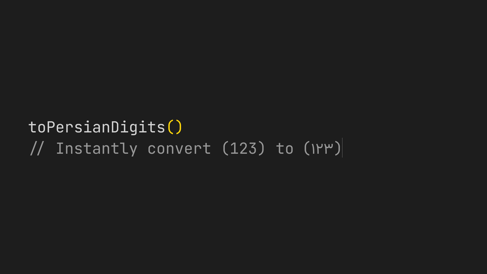

# toPersianDigits

Figma does not automatically localize digits. Even if your font supports Persian numerals, English digits (0-9) can remain Latin Unicode characters.

This plugin converts English digits to true Persian numerals (۰–۹) by replacing their Unicode values, ensuring proper Persian typography across your designs.

## What it does

- Converts 0–9 → ۰–۹
- Works across nested frames and groups
- Supports mixed fonts
- Batch processes selected layers

If your Persian font looks right but your numbers don’t, this fixes it.
